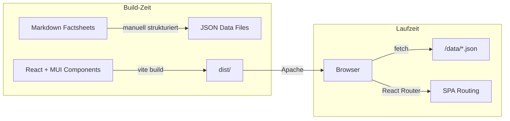
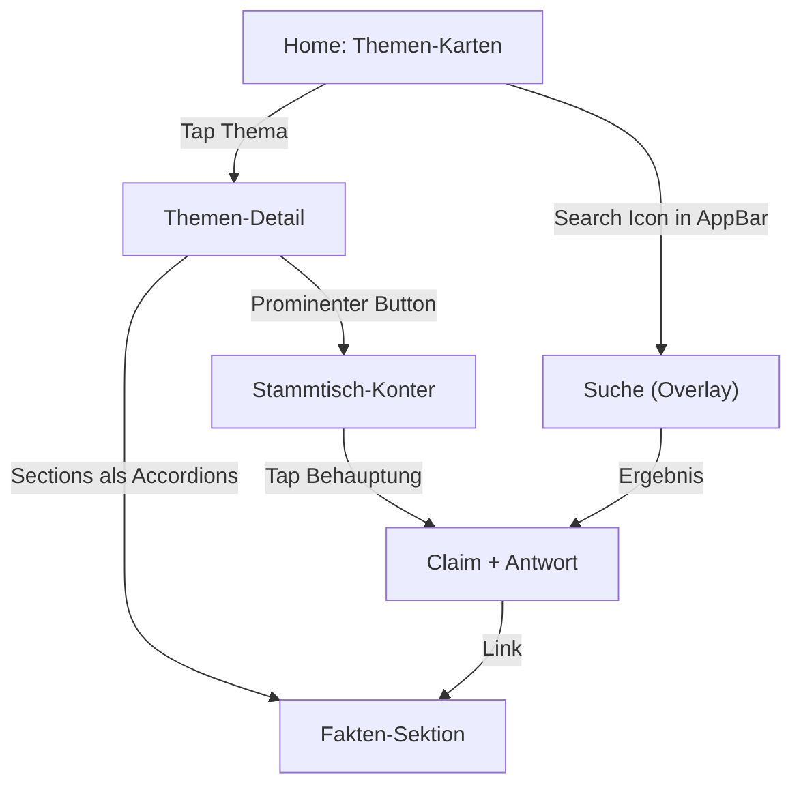

# Fakten-Stammtisch: Implementierungsplan

## Architektur

Statische React SPA (Vite + MUI v7), die JSON-Factsheets zur Laufzeit laedt. Kein Backend, kein SSR. Deployment als statische Dateien auf Apache-Webhosting mit `.htaccess` fuer SPA-Routing.




## Datenarchitektur

Die Markdown-Factsheets werden in ein strukturiertes JSON-Format ueberführt. Jedes Thema ist eine eigene JSON-Datei unter `public/data/`. Ein zentraler Index (`topics.json`) listet alle verfuegbaren Themen.

**Schema pro Thema** (`public/data/heizung.json`):

```json
{
  "id": "heizung",
  "title": "Heizungswechsel 2026",
  "subtitle": "Wärmepumpe vs. Öl- & Gasheizung",
  "icon": "heat_pump",
  "lastUpdated": "2026-03",
  "sourceNote": "Fraunhofer ISE, BWP, BDH, ...",
  "sections": [
    {
      "id": "status-quo",
      "title": "Status Quo",
      "content": [
        { "type": "fact", "text": "21,6 Mio. Heizungen in DE", "highlight": true },
        { "type": "fact", "text": "75 % fossil (Gas 56 %, Öl 17 %)" },
        { "type": "table", "headers": ["..."], "rows": [["..."]] }
      ]
    }
  ],
  "arguments": [
    {
      "id": "wp-nur-neubau",
      "claim": "Wärmepumpe lohnt sich nur im Neubau!",
      "response": "Falsch. Fraunhofer ISE (2025): ...",
      "keywords": ["wärmepumpe", "neubau", "altbau", "bestand"],
      "relatedSections": ["fraunhofer-ise"]
    }
  ],
  "sources": [
    { "label": "Fraunhofer ISE (2025)", "url": "https://..." }
  ]
}
```

**Vorteile dieser Trennung:**

- Fakten-Updates ohne Code-Aenderungen
- Neue Themen = neue JSON-Datei + Eintrag in `topics.json`
- Suchindex wird aus den JSON-Daten zur Laufzeit gebaut

## UX-Konzept (Mobile-First)




### Screens und Navigation

1. **Home** (`/`): TopicCards mit Titel, Untertitel, Icon, Key-Stats. Bei nur 2 Themen: grosszuegige Karten.
2. **Thema** (`/thema/:id`): AppBar mit Themen-Titel. Zwei Tabs:
  - **Fakten**: Sections als MUI Accordions (aufklappbar, kompakt)
  - **Stammtisch-Konter**: Liste der typischen Behauptungen als Karten
3. **Suche**: Suchfeld in der AppBar (immer sichtbar). Sucht ueber alle Themen in `arguments[].claim`, `arguments[].response`, `arguments[].keywords` und `sections[].content[].text`. Ergebnisse als gruppierte Liste.

### Mobile-UX-Details

- **AppBar** fixiert oben, mit Suchfeld und Zurueck-Navigation
- **Tabs** (MUI Tabs) fuer Fakten/Konter innerhalb eines Themas, swipeable
- **Accordions** fuer Fakten-Sektionen (platzsparend, scanbar)
- **Cards** fuer Stammtisch-Konter: Behauptung als Titel, Antwort aufklappbar
- Touch-Targets mindestens 48px, grosse Schrift fuer schnelles Lesen
- Dark Mode Support (MUI Theme Toggle in AppBar)

## Tech-Stack


| Paket                                | Version | Zweck                    |
| ------------------------------------ | ------- | ------------------------ |
| `react` + `react-dom`                | 19.x    | UI Framework             |
| `@mui/material`                      | 7.x     | Component Library        |
| `@mui/icons-material`                | 7.x     | Icons                    |
| `@emotion/react` + `@emotion/styled` | 11.x    | Styling (MUI Dependency) |
| `react-router-dom`                   | 7.x     | Client-Side Routing      |
| `vite`                               | 6.x     | Build Tool               |
| `@vitejs/plugin-react`               | 4.x     | Vite React Plugin        |
| `typescript`                         | 5.x     | Type Safety              |


**Kein** MUI X noetig fuer v1 (keine DataGrids, DatePickers etc. benoetigt).

## Projektstruktur

```
facts/
├── public/
│   └── data/                    # JSON-Factsheets (zur Laufzeit geladen)
│       ├── topics.json          # Themen-Index
│       ├── heizung.json
│       └── energiewende.json
├── src/
│   ├── components/
│   │   ├── layout/
│   │   │   ├── AppShell.tsx     # AppBar + Container + Theme
│   │   │   └── SearchBar.tsx    # Such-Input in AppBar
│   │   ├── home/
│   │   │   └── TopicCard.tsx    # Themen-Karte auf Home
│   │   ├── topic/
│   │   │   ├── TopicView.tsx    # Themen-Detail mit Tabs
│   │   │   ├── FactSection.tsx  # Akkordeon-Sektion
│   │   │   └── ArgumentCard.tsx # Stammtisch-Konter-Karte
│   │   └── search/
│   │       └── SearchResults.tsx # Suchergebnis-Liste
│   ├── hooks/
│   │   ├── useTopics.ts         # JSON laden + cachen
│   │   └── useSearch.ts         # Suchlogik (clientseitig)
│   ├── types/
│   │   └── index.ts             # TypeScript Interfaces
│   ├── theme.ts                 # MUI Theme (mobile-first, light/dark)
│   ├── App.tsx                  # Router Setup
│   └── main.tsx                 # Entry Point
├── input/                       # Original-Markdown (Quellmaterial)
├── index.html
├── vite.config.ts
├── tsconfig.json
├── package.json
└── .htaccess                    # Apache SPA Fallback
```

## Routing (BrowserRouter + .htaccess)

```
/                    → Home (Themen-Uebersicht)
/thema/:topicId      → Themen-Detail (Fakten + Konter)
/suche?q=...         → Suchergebnisse
```

`**.htaccess**` fuer Apache SPA-Fallback:

```apache
RewriteEngine On
RewriteBase /
RewriteRule ^index\.html$ - [L]
RewriteCond %{REQUEST_FILENAME} !-f
RewriteCond %{REQUEST_FILENAME} !-d
RewriteRule . /index.html [L]
```

## Suchlogik (Client-Side)

Einfacher clientseitiger Suchindex, der beim ersten Laden aus den JSON-Daten gebaut wird:

- Durchsucht: `arguments[].claim`, `arguments[].response`, `arguments[].keywords`, `sections[].title`, `sections[].content[].text`
- Matching: Case-insensitive Substring-Match, gewichtet (Keywords > Claim > Response > Fakten)
- Ergebnisse gruppiert nach Thema, mit Highlight des Match-Kontexts
- Keine externe Suchbibliothek noetig bei der aktuellen Datenmenge (2 Themen)

## Vorbereitung fuer spaetere Features

- **PWA**: `vite-plugin-pwa` kann spaeter ergaenzt werden, Architektur ist kompatibel (JSON-Daten sind cachebar)
- **Share**: Deeplinks pro Argument (`/thema/:id#arg-:argId`) sind vorbereitet, Web Share API spaeter ergaenzbar
- **Neue Themen**: Neue JSON-Datei + Eintrag in `topics.json`, kein Code noetig

## Offene Design-Entscheidungen

Folgendes wuerde ich waehrend der Implementierung festlegen, sofern du keine Praeferenz hast:

- Farbschema/Branding (Vorschlag: sachlich-neutral, keine Parteifarben, Blau/Grau-Toene)
- Ob Dark Mode direkt in v1 oder spaeter
- Favicon/App-Name fuer den Browser-Tab

